<div align="center">
  <picture>
    <source media="(prefers-color-scheme: dark)" srcset="assets/hero-dark.svg"/>
    
  </picture>
</div>

<div align="center">
  
</div>

<br/>

## &gt; whoami

```yaml
# ck-labs.config
identity:
  handle : C-K-Labs
  role   : security researcher
  focus  : [ ai-x-ml security, network defense, secure code review ]

active:
  - comparing manual security review vs automated SAST on AI-generated code
  - building SentinelArc :: LAN DDoS detection and response platform
  - local-first AI tooling for authorized penetration testing

principle: "defense in depth. curiosity in excess."
```

<div align="center">
  <picture>
    <source media="(prefers-color-scheme: dark)" srcset="assets/terminal-dark.svg"/>
    
  </picture>
</div>

<br/>

## &gt; ls ./featured

<table>
  <tr>
    <td width="50%">
      <a href="https://github.com/C-K-Labs/MercySTEM-SentinelArc">
        <picture>
          <source media="(prefers-color-scheme: dark)" srcset="assets/card-sentinelarc-dark.svg"/>
          
        </picture>
      </a>
    </td>
    <td width="50%">
      <a href="https://github.com/C-K-Labs/Mercy-Hackathon-CCCAlert">
        <picture>
          <source media="(prefers-color-scheme: dark)" srcset="assets/card-cccalert-dark.svg"/>
          
        </picture>
      </a>
    </td>
  </tr>
  <tr>
    <td width="50%">
      <a href="https://github.com/C-K-Labs/pentest-ai-suite">
        <picture>
          <source media="(prefers-color-scheme: dark)" srcset="assets/card-pentest-dark.svg"/>
          
        </picture>
      </a>
    </td>
    <td width="50%">
      <a href="https://github.com/C-K-Labs/ai-code-security-review">
        <picture>
          <source media="(prefers-color-scheme: dark)" srcset="assets/card-aicsr-dark.svg"/>
          
        </picture>
      </a>
    </td>
  </tr>
</table>

<div align="center">
  <picture>
    <source media="(prefers-color-scheme: dark)" srcset="assets/ops-scene-dark.svg"/>
    
  </picture>
</div>

<br/>

## &gt; cat ./arsenal

<div align="center">
  
  
  
  
  
  <br/>
  
  
  
  
</div>

<br/>

## &gt; ./telemetry --live

<div align="center">
  <picture>
    <source media="(prefers-color-scheme: dark)" srcset="https://github-readme-stats.vercel.app/api?username=C-K-Labs&show_icons=true&hide_border=true&theme=tokyonight&bg_color=1a1b26"/>
    
  </picture>
  <picture>
    <source media="(prefers-color-scheme: dark)" srcset="https://github-readme-stats.vercel.app/api/top-langs/?username=C-K-Labs&layout=compact&hide_border=true&theme=tokyonight&bg_color=1a1b26"/>
    
  </picture>
</div>

<div align="center">
  <picture>
    <source media="(prefers-color-scheme: dark)" srcset="https://streak-stats.demolab.com?user=C-K-Labs&hide_border=true&background=1a1b26&ring=7aa2f7&fire=7dcfff&currStreakLabel=7aa2f7&sideLabels=9aa5ce&currStreakNum=c0caf5&sideNums=c0caf5&dates=565f89"/>
    
  </picture>
</div>

<br/>

<div align="center">
  <picture>
    <source media="(prefers-color-scheme: dark)" srcset="https://raw.githubusercontent.com/C-K-Labs/C-K-Labs/output/github-snake.svg"/>
    
  </picture>
</div>

<br/>

<div align="center">
  <sub><code>[ EOF ] :: thanks for scrolling. connections welcome.</code></sub>
</div>
