<div align="center">
  
</div>

<div align="center">
  
</div>

<br/>

## &gt; whoami

```yaml
# ck-labs.config
identity:
  handle : C-K-Labs
  role   : security researcher
  focus  : [ ai-x-ml security, network defense, secure code review ]

active:
  - comparing manual security review vs automated SAST on AI-generated code
  - building SentinelArc :: LAN DDoS detection and response platform
  - local-first AI tooling for authorized penetration testing

principle: "defense in depth. curiosity in excess."
```

<div align="center">
  
</div>

<br/>

## &gt; ls ./featured

<table>
  <tr>
    <td width="50%">
      <a href="https://github.com/C-K-Labs/MercySTEM-SentinelArc">
        
      </a>
    </td>
    <td width="50%">
      <a href="https://github.com/C-K-Labs/Mercy-Hackathon-CCCAlert">
        
      </a>
    </td>
  </tr>
  <tr>
    <td width="50%">
      <a href="https://github.com/C-K-Labs/pentest-ai-suite">
        
      </a>
    </td>
    <td width="50%">
      <a href="https://github.com/C-K-Labs/ai-code-security-review">
        
      </a>
    </td>
  </tr>
</table>

<div align="center">
  
</div>

<br/>

## &gt; cat ./arsenal

<div align="center">
  
  
  
  
  
  <br/>
  
  
  
  
</div>

<br/>

## &gt; ./telemetry --live

<div align="center">
  <picture>
    <source media="(prefers-color-scheme: dark)" srcset="https://github-readme-stats.vercel.app/api?username=C-K-Labs&show_icons=true&hide_border=true&bg_color=0b0518&title_color=ff2e97&text_color=a794d4&icon_color=00e5ff&ring_color=ff2e97"/>
    
  </picture>
  <picture>
    <source media="(prefers-color-scheme: dark)" srcset="https://github-readme-stats.vercel.app/api/top-langs/?username=C-K-Labs&layout=compact&hide_border=true&bg_color=0b0518&title_color=ff2e97&text_color=a794d4"/>
    
  </picture>
</div>

<div align="center">
  <picture>
    <source media="(prefers-color-scheme: dark)" srcset="https://streak-stats.demolab.com?user=C-K-Labs&hide_border=true&background=0b0518&ring=ff2e97&fire=00e5ff&currStreakLabel=ff2e97&sideLabels=a794d4&currStreakNum=f3e8ff&sideNums=f3e8ff&dates=6a5a92"/>
    
  </picture>
</div>

<br/>

<div align="center">
  <picture>
    <source media="(prefers-color-scheme: dark)" srcset="https://raw.githubusercontent.com/C-K-Labs/C-K-Labs/output/github-snake.svg"/>
    
  </picture>
</div>

<br/>

<div align="center">
  <sub><code>[ EOF ] :: thanks for scrolling. connections welcome.</code></sub>
</div>
